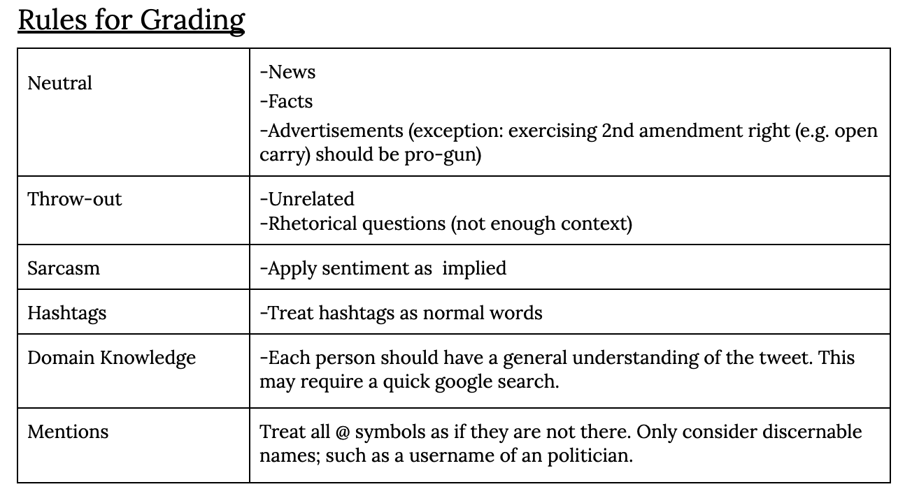
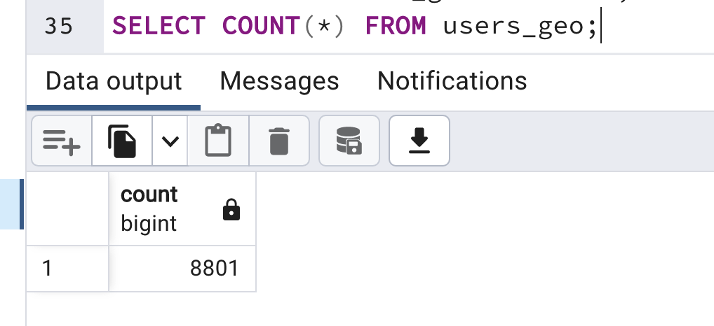
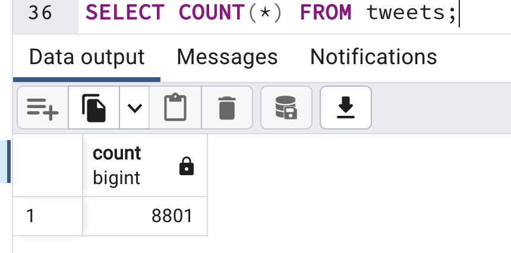
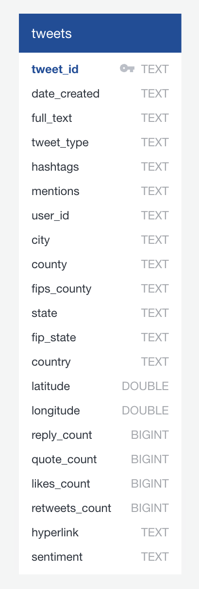
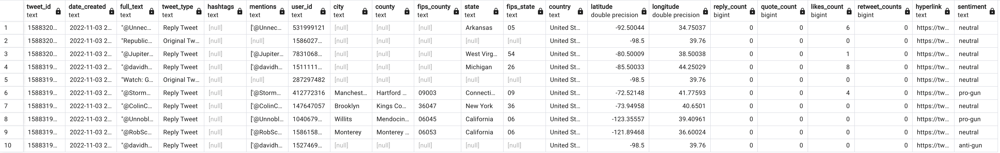
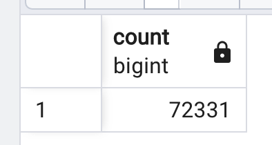
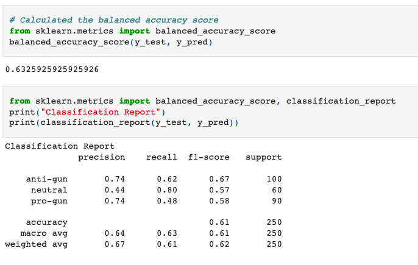

    
# **
<u>Final Project: Twitter Sentiment Analysis</u>
**

 

## <u>Project Overview</u>

 

### Executive Summary

Our team has decided to utilize Machine Learning to conduct a Sentiment Analysis on Gun Control using Natural Language Processing (NLP) and Machine Learning (ML) libraries and tools. Our team has opted to find and review tweets that contain a number of predetermined relevant keywords and focus on the 2022 Midterm Elections timeframe.
The team initially conducted a few team sessions to align on classification criteria on a set of 100 tweets. This allowe us to more closely agree on classifying 1,000 tweets to train our ML models. Once trained and tested, we will decide on the most accurate ML model and proceed to analyze at least 50,000 tweets to understand sentiment on gun-control in the days leading to the election, on election day and days after the election. Ultimately, the team will use the metadata to make appropriate data visualization tools and provide summaries and opinions on the data.

The data results will be discussed in the "Results" section. A summary section will contain the teams' findings, reporting, considerations and any recommendations for future studies.

_For more details please follow [this link to our Presentation](https://docs.google.com/presentation/d/1TRPxj6cEf4k-Avy5Alyz2rMj5ESAWoMiApBG1nt9WuY/view)._

 

### Meet the Team
Dana Burton 
[LinkedIn](https://www.linkedin.com/in/dana-burton-942767179/) 
[github](https://github.com/Danaburtono)

David Martinez 
[LinkedIn](https://www.linkedin.com/in/dana-burton-942767179/) 
[github](https://github.com/mrmarken)

Keerti Chaudhary 
[LinkedIn](https://www.linkedin.com/in/keerti-chaudhary/) 
[github](https://github.com/17keerti)

Kevin Eapen 
[LinkedIn](https://linkedin.com/in/kevin-eapen) 
[github](https://github.com/kevin-eapen)

 

### Topic Selection

Our team had been considering doing a Sentiment Analysis prior to the introduction of the Big Data module (in September 2022). After going through the Big Data and subsequent ML modules, we agreed we would do use NLP and ML to conduct an analysis of people's pro-gun and anti-gun sentiments expressed on Twitter on the days leading to the 2022 Mid-Term Elections held on November 8, 2022.
Once the ML model is trained to an acceptable accuracy range, the analysis should allow to present sentiment percentages across the population of tweets gathered. The tweet population will be limited to the United States. Ultimately, the team aims to present the variation of sentiment across various dates leading up to and post the election. If our premium-access-tier request is approved, the team aims to include an analysis of sentiment variation throughout various regions of the country to better understand how the pro- and anti-gun sentiment is distributed across the country through the time period described herein.

 

### Data Sources

- Twitter API v2 (Prototype Data)
  - Search Tweets: Recent Tweets endpoint 
    - [Developer Documentation](https://developer.twitter.com/en/docs/twitter-api/tweets/search/api-reference/get-tweets-search-recent)  
     
- Twitter API v1.1 Premium

  - Search Tweets: 30-day endpoint
    - [Developer Documentation](https://developer.twitter.com/en/docs/twitter-api/premium/search-api/api-reference/premium-search#DataEndpoint)

   

### Software Used

- Python 3.7.13
- Jupyter Notebook:
  - IPython : 7.31.1
  - ipykernel : 6.9.1
  - ipywidgets : 7.6.5
  - jupyter_client : 6.1.12
  - jupyter_core : 4.9.2
  - jupyter_server : 1.13.5
  - jupyterlab : 3.3.2
  - nbclient : 0.5.13
  - nbconvert : 6.4.4
  - nbformat : 5.3.0
  - notebook : 6.4.8
  - qtconsole : 5.3.0
  - traitlets : 5.1.1
- ML Methods:
  - Naive Bayes
  - Support Vector Machine
  - Random Forest
  - Adaptive Boosting

   

## <u>Methodology</u>

 

The following section contains details about the project and how the team derived results from the analysis.

 

### Documentation

The following documentation is as part of this project:

- [Group 6 Final Project Proposal](https://docs.google.com/document/d/1S8YDuH4BK8O7xqQIlRqUP676FcTqAoM3K-G383fwP4o/view)
- [Final Project Process Overview](https://docs.google.com/document/d/1R5ymXR9j9KWXxl4_9Ug5ayz2Q5TtuGFOi0grzYWA0bA/view)
- [Final Project Sync Notes](https://docs.google.com/document/d/1iTBQPR0OlELasVzcAgVBxvX7SSCtxc45m7_skaS3vUk/edit?usp=sharing)
- [Sentiment Escalation Document](https://docs.google.com/spreadsheets/d/13RjYV8dsDT5S_7FYCZnv0HFMDhcJ1tWlg64CPmpNRaQ/edit?usp=sharing)

 

### Branching

The team agreed to use the following branching strategy:

- During each segment, each team member creates a new branch with the following syntax:
  - firstname_segment#

_More details on [this Google document](https://docs.google.com/document/d/1R5ymXR9j9KWXxl4_9Ug5ayz2Q5TtuGFOi0grzYWA0bA/view)._

 

### Data Extraction

To retrieve the necessary natural language text data for processing and analysis, our team chose to utilize the Twitter API. The Twitter API is the Application Programming Interface of the company Twitter, a popular microblogging and social networking service platform. The Twitter API has a few available versions and access tiers with various endpoints. We used the Search Tweets endpoint of the Twitter API v2 service on the Essential access tier to procure 100 tweets as a sample text dataset for classification and prediction model prototyping.

Our project protocols rely heavily on the Python programming language, therefore, we chose to use the Tweepy 4.11.0 ([Developer Documentation](https://docs.tweepy.org/en/stable/client.html#search-tweets)) Python library to authenticate and interact with Twitter’s interface endpoints. Through use of Python and Tweepy in a Jupyter Notebook with our project environment kernel, we were able to utilize the Search Tweets query parameter to select the most recent tweets (within the last 7 days) for the hashtags #uvalde and #guncontrol. The query also filtered for tweets that are not retweets, as well as only tweets in the English language. Tweepy’s Paginator was also used to perform pagination through Twitter’s API in order to select 10 tweets before selecting the next page and selecting another 10 tweets. This pagination was repeated until 100 tweets (50 tweets for each hashtag) were fetched and received in the API responses. Once the fetching process was complete, the tweets were aggregated in an array using a Python for loop. After containing the tweets in a list format, the tweets were combined into a Pandas dataframe and then exported as a CSV file for portability and further wrangling of the acquired dataset.

The next phase for our project focuses on a greater variety of tweets on our subject matter: sentiment about guns and gun control near and around the 2022 US midterm elections. For this phase we upgraded to the Twitter API v1.1 premium tier for access to the Search Tweets 30-day endpoint, as well as twitter profile geo data. We expanded our query to get a broader range of tweets regarding sentiment on guns. Our results include more fields from the Search Tweets 30-day endpoint for additional features to the data including Tweet IDs, Tweet Metrics User IDs, Profile Geo-Data, and UTC Timestamps. For our training data we acquired over 8,000 tweets from November 2, 2022 with this feature set. We annotated the tweets from this dataset with sentiment classifications for our final model training phase. 

Since our project focuses on sentiment regarding guns and gun control near and around the 2022 US midterm elections, we utilized the 30-day Search Tweets endpoint to pull between 4,000 to 10,000 tweets for each day (number of tweets per day resulted varies based on twitter activity) for a range of 5 days before, 5 days after, and the day of the election, November 8, 2022, as the midpoint. In total, over 72,000 tweets were pulled from an 11-day span. This big dataset of tweets included the same feature set as the above training dataset (without sentiment annotations). 

 

### Data Annotation

#### Training the Trainers

At the prototyping phase, 2 team members were assigned a set of 50 tweets that were extracted through the Twitter API v2 which contained one of two hashtags: #uvalde or #guncontrol.
In total, 100 tweets were used (50 per each 2 team members) to classify the dataset.
After each member submitted their respective sentiment classification, the results were combined into one single csv file. This file was further processed using pandas DataFrames to create a new column identifying conflicts in classification. Using this file, the team held several meetings to ensure alignment on the methodology for classifying tweet sentiment. During this review, we still ended with 6% of tweets that we could not fully agree on classification. After iteratively reviewing tweet classifications in more depth we settled on a standard grading rubric for the classification of the training data for predictive modeling.

The goal for our final training data was to have 1,000 rows of classified tweets. The team decided to use the following classifications and percentages to train the ML models and decide which model provides the best accuracy:

- Pro-gun - 40%
- Anti-gun - 40%
- Neutral - 20%

Out of the over 8,000 tweets fetched for our pool of training data, we were able to collectively classify over 2,000 tweets. After our intial annotating of the training data, we realized there were far more neutral tweets (as defined in our rubric) than the other two classes, and generally more anti-gun tweets than pro-gun. In order to achieve our desired class balance for our training data for machine learning, we collectively classified over 2000 tweets to achieve a 1000 tweet final training dataset of 400 pro-gun, 400 anti-gun, and 200 neutral tweets.

Final Data Annotation Rubric

 

### Data Transformations and Loading Database

#### Training Data
We extracted our training dataset, which contains over 8000 tweets with an accompanying set of features, from the Twitter API. We then transformed the data by parsing the API response JSON objects and appending the data from each tweets object to a list of dictionaries. Once all the data features were extracted and put into a pandas dataframe we transformed and formatted the columns until it matched our designed training database schema. We are hosting the database on Amazon Web Services' RDS platform with a Postgresql connection. 

The data was also stored in both raw JSON format and parsed, tabular CSV format in an Amazon S3 bucket. In order to split the dataset into a user-based geographical dataset and a tweets with text and metadata dataset, we first had to retrieve the user's "str_id" from the raw JSON data, which was eventually joined to the rest of the data on the Tweet IDs using Pyspark. Once the data was sufficiently transformed, we selected the features for two separate data tables matching the schema. 

Two tables were loaded into the database using Spark and a Postgresql driver. One table (tweets) contained the tweets text data, along with other metrics, and sentiment classifcation, while the other table (users_geo) contained the user location data. The tables are linked by the user IDs. Once loaded into the database, the data tables were also joined in SQL as 'tweets_user_geo_joined'.

Training Data - Database ERD  

Confirmation of Loading Training Dataset to Postgresql DB  

AWS-RDS Instance  

 

#### Big Data: 70K+ Tweets Around 2022 US Midterms Election Day

After training and testing our gun sentiment prediction model, we sought to collect a larger set of tweets data to classify using the model for futher analysis and insights on gun sentiment expressed on twitter around the US midterm elections. Once we decided on our final machine learning model, we extracted over 72,000 tweets over an 11-day span (centered around the November 8, 2022 election day) from the Twitter API. 

We parsed the API returned JSON objects for the necessary features extraction, similarly done when extracting the training data as described above. We took extra data transformation steps, such as reformatting the date to standard ISO format using Python Datetime and adding FIPS codes to state and county level data using the 'AddFIPS' python module. Additionally, upon inital export to CSV and later using the Pandas 'read_csv' method to read the file for model predictions, it was discovered that Pandas misinterpreted some characters in the 'full_text' column resulting in mixed data type columns from column values being incorrectly delimited under the wrong headers by Pandas. Since the raw JSON objects for each tweet fetched were saved to a .json file, it was decided to repeat data parsing and transformations using the raw data file and include double quote wrapping of the 'full_text' column to avoid further delimiting errors upon export to CSV. 

Once the big data CSV was remade, it was read by Pandas and used by the machine learning model for sentiment classification. After the model created automated predictions for classifying the data, the predicted sentiments were appended to the dataframe and the final big dataset was exported to CSV. This final CSV was read into a Python notebook, where a Postgresql database connection was established to a new database in the AWS-RDS server using SQLalchemy. Also using SQLalchemy, the final big dataset with predicted sentiments on guns was loaded to the PostgresSQL AWS-RDS database. 

ERD  
  

Final Elections Gun Sentiment Tweets Database (First 10 rows)  

Confirmation of Loading Final Big Dataset to Postgresql DB  

 

### Data Preprocessing

Before training the model, we performed various pre-processing steps on the dataset. Firstly, we converted the text into the lowercase for better generalization and then we dealt with removing special characters, single character, multiple spaces.

Subsequently, we defined stopwords and stopwords were cleaned and removed thereby reducing the unnecessary data from the tweets. After that, we also removed the URLs along with removing the numeric numbers from the words as they do not have any significant importance.

 

### Feature Selection

After preprocessing data, we performed tokenization, stemming and lemmatizer. For feature extraction we used CountVectorizer to convert a collection of text documents to a vector of token counts. It tokenizes the documents to build a vocabulary of the words present in the corpus and counts how often each word from the vocabulary is present in each and every document in the corpus. We also used the parameter ngram_range = (1,4) which tells the vectorizer to use four successive words along with each single word as features for the resulting vector representation.

  

## Machine Learning Model

After classifying training data of 1000 tweets, we ran the following machine learning models-

- Balanced Random Forest Classifier
- Bernoulli Naive Bayes
- Multinomial Naive Bayes

.png>)
.png>)

We got low precision and F1 score for neutrals as classifying neutrals is subjective, so we decided to set new strict rules for neutrals and updated the dataset for training with new classfied neutrals.

The following images show the F1 score and Precision with new training dataset:

.png>)
.png>)

After updating dataset with new defination of neutrals, precision for neutrals improved but at the cost of decreased precision for anti-gun and pro-gun. For this project our main focus was to classify tweet sentiment as anti-gun and pro-gun so we decided to go with Balanced Random Forest classifier with initial dataset for training which gave better precision for pro-gun and anti-gun.

   

## Results

### ML Accuracy and Precision
During our analysis, the team discovered that the ML model would be able to identify anti-gun and pro-gun sentiment with a precision of ~74% and an accuracy of ~63%.

The classification report and accuracy for Balanced Random Forest Classifier:

 

**The following sections provide an overview of the results:**

### Twitter Classification

#### Overall Results
The team used the >70K tweets with our identified Machine Learning model and obtained the following results:
 

  

#### State and County Results

Similarly, the data yielded the following breakdowns per state and per county (as available):

 

 

  

#### Hashtags and @ Mentions Results
The team was also able to obtain the top mentions for hashtags and @(individuals) mentions:
 

 

   

## Project Analysis

### Predict tweet sentiment using ML
After conducting the machine learning process on all 70,000+ tweets, we loaded our data into Postgres via SQLAlchemy connection. It was at this point, that we were able to analyze our results in Tableau. 
 

### Overall Tweet Sentiment Around the 2022 Midterm Election
In the line graph below, we illustrate how much anti-gun and pro-gun sentiment varied in the days before, the days prior, and the day of the election November 8th. November 8th being the highest volume of tweets for both types of sentiment. 

 

### Trends:
- An unanticipated trend in the data shows a stark downward slope in anti-gun sentiment only a few days after the election, while pro-gun sentiment took longer to subside. 
- There seems to have been a peak in sentiment on November 3rd, which is likely correlated to another recent event of the Parkland school shooter Nickolas Cruz was sentenced to life without parole for the massacre of 17 people in 2018. 
 

### Sentiment Across US States
During this analyzing phase, we reviewed how many different states reacted during this time period amidst political conversations and ongoing shootings across the country. In the example below we see the California sentiment is similar to the US overall.

 

In juxtoposition to California, a state like Missouri where sentiment was much more unpredicatable and volatile. The event of the Parkland shooter being sentenced to prison garned more tweets that even the day of the election with a large percentage of pro-gun sentiment. 

### Sentiment Across CA Counties
Below is a graph of Orange County, CA this county is prodominantly right-leaning. This is echoed in the graph as quanities of pro-gun sentiment and anti-gun snetiment are in competition.

 
Below is a graph of Alamenda County, CA this county is prodominately left-leaning. This is echoed in the graph as pro-gun sentiment is very low. 

### Overall Conclusion

Overall this project revealed many naunces about aquiring data, pre-processing data, classifying data, storing data, conducting machine learning models, and implementing visualizations. The results of the machine learning algorithm showed us many new insight about how people feel about gun control and gun rights in the US. In this review I have only showed a few states and counties, please feel free to go to our deployed Dashboard site to learn more about Gun Sentiment during the 2022 Midterm Election. 

[Dashboard Link](https://public.tableau.com/app/profile/dana.o.burton/viz/Sentiment_Analysis_Tableau_Workbook/Dashboard1) 

## Summary & Recommendations

After navigating through this project, using ML model to predict tweet sentiment analysis, the team learned a few items:

1. More data rows are needed to train the model
   - This would be at least 5,000 tweets to allow for more anti-gun, pro-gun and neutral sentiment.
2. Additional aligmnent on the manual classification 
   - This should help us in better training the model.
3. Create a system for tagging sarcasm and rerun the model with and without sarcastic tweets
    - We would like to know if precision and F1-scores can be improved by providing the model with less ambigious sentiment. 
3. Use more days as training data
   - Some tweets repeated in a single day.
4. Obtain more data
   - This should provide more geo-location data points for our analysis.
5. Gather additional gun-violence statistics
   - We hope this will allow us to make correlations on gun-laws with regards to gun-violence on a state-by-state (or county-by-county) basis.
   