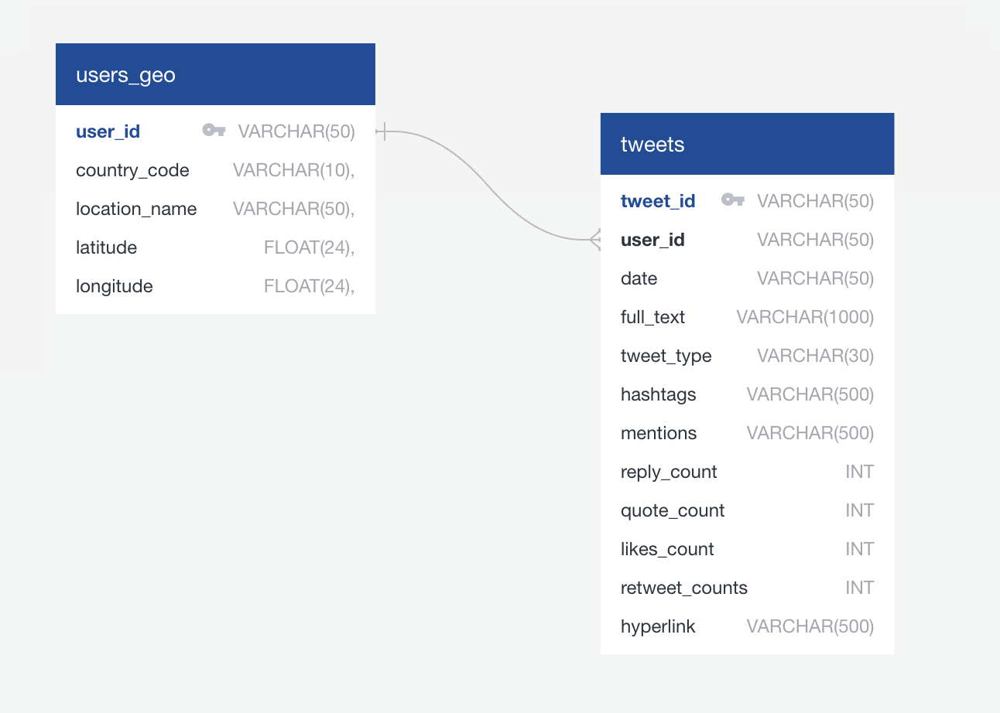
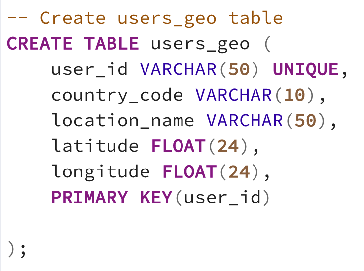
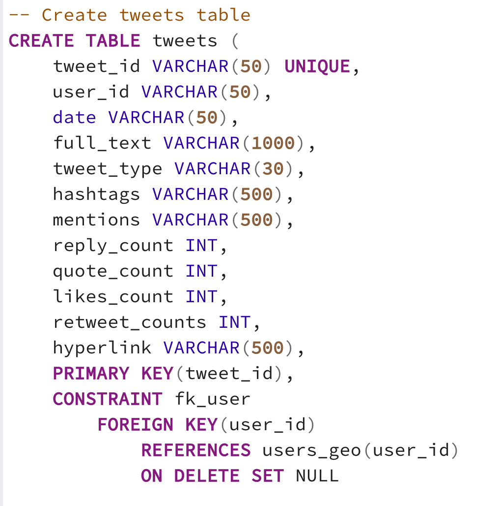

# **Final Project: Twitter Sentiment Analysis**

  

## Project Overview

### Executive Summary

Our team has decided to utilize Machine Learning to conduct a Sentiment Analysis on Gun Control using Natural Language Processing (NLP) and Machine Learning (ML) libraries and tools. Our team has opted to find and review tweets that contain a number of predetermined relevant keywords and focus on the 2022 Midterm Elections timeframe.
The team initially conducted a few team sessions to align on classification criteria on a set of 100 tweets. This allowe us to more closely agree on classifying 1,000 tweets to train our ML models. Once trained and tested, we will decide on the most accurate ML model and proceed to analyze at least 100,000 tweets to understand sentiment on gun-control in the days leading to the election, on election day and days after the election. Ultimately, the team will use the metadata to make appropriate data visualization tools and provide summaries and opinions on the data.

The data results will be discussed in the "Results" section. A summary section will contain the teams' findings, reporting, considerations and any recommendations for future studies.

_For more information please follow [this link to our Presentation](https://docs.google.com/presentation/d/17xTJZuJfjp9j-S1KO1LkmC7HXK9N8dtZxxIwg6lGEYU/edit?usp=sharing)._

 

### Topic Selection

Our team had been considering doing a Sentiment Analysis prior to the introduction of the Big Data module (in September 2022). After going through the Big Data and subsequent ML modules, we agreed we would do use NLP and ML to conduct an analysis of people's pro-gun and anti-gun sentiments expressed on Twitter on the days leading to the 2022 Mid-Term Elections held on November 8, 2022.
Once the ML model is trained to an acceptable accuracy range, the analysis should allow to present sentiment percentages across the population of tweets gathered. The tweet population will be limited to the United States. Ultimately, the team aims to present the variation of sentiment across various dates leading up to and post the election. If our premium-access-tier request is approved, the team aims to include an analysis of sentiment variation throughout various regions of the country to better understand how the pro- and anti-gun sentiment is distributed across the country through the time period described herein.

 

### Data Sources

- Twitter API v2 (Prototype Data)
  - Search Tweets: Recent Tweets endpoint - [Developer Documentation](https://developer.twitter.com/en/docs/twitter-api/tweets/search/api-reference/get-tweets-search-recent)  
     
- Twitter API v1.1 Premium

  - Search Tweets: 30-day endpoint
    - [Developer Documentation](https://developer.twitter.com/en/docs/twitter-api/premium/search-api/api-reference/premium-search#DataEndpoint)

   

### Software Used

- Python 3.7.13
- Jupyter Notebook:
  - IPython : 7.31.1
  - ipykernel : 6.9.1
  - ipywidgets : 7.6.5
  - jupyter_client : 6.1.12
  - jupyter_core : 4.9.2
  - jupyter_server : 1.13.5
  - jupyterlab : 3.3.2
  - nbclient : 0.5.13
  - nbconvert : 6.4.4
  - nbformat : 5.3.0
  - notebook : 6.4.8
  - qtconsole : 5.3.0
  - traitlets : 5.1.1
- ML Methods:
  - Naive Bayes
  - Support Vector Machine
  - Random Forest
  - Adaptive Boosting

   

## Methodology

The following section contains details about the project and how the team derived results from the analysis.

 

### Documentation

The following documentation is captured as part of this repository:

- [Group 6 Final Project Proposal](https://docs.google.com/document/d/1S8YDuH4BK8O7xqQIlRqUP676FcTqAoM3K-G383fwP4o/view)
- [Final Project Process Overview](https://docs.google.com/document/d/1R5ymXR9j9KWXxl4_9Ug5ayz2Q5TtuGFOi0grzYWA0bA/view)

 

### Branching

The team agreed to use the following branching strategy:

- During each segment, each team member creates a new branch with the following syntax:
  - firstname_segment#

_More details on [this Google document](https://docs.google.com/document/d/1R5ymXR9j9KWXxl4_9Ug5ayz2Q5TtuGFOi0grzYWA0bA/view)._

 

### Data Extraction

To retrieve the necessary natural language text data for processing and analysis, our team chose to utilize the Twitter API. The Twitter API is the Application Programming Interface of the company Twitter, a popular microblogging and social networking service platform. The Twitter API has a few available versions and access tiers with various endpoints. We used the Search Tweets endpoint of the Twitter API v2 service on the Essential access tier to procure 100 tweets as a sample text dataset for classification and prediction model prototyping.

Our project protocols rely heavily on the Python programming language, therefore, we chose to use the Tweepy 4.11.0 ([Developer Documentation](https://docs.tweepy.org/en/stable/client.html#search-tweets)) Python library to authenticate and interact with Twitter’s interface endpoints. Through use of Python and Tweepy in a Jupyter Notebook with our project environment kernel, we were able to utilize the Search Tweets query parameter to select the most recent tweets (within the last 7 days) for the hashtags #uvalde and #guncontrol. The query also filtered for tweets that are not retweets, as well as only tweets in the English language. Tweepy’s Paginator was also used to perform pagination through Twitter’s API in order to select 10 tweets before selecting the next page and selecting another 10 tweets. This pagination was repeated until 100 tweets (50 tweets for each hashtag) were fetched and received in the API responses. Once the fetching process was complete, the tweets were aggregated in an array using a Python for loop. After containing the tweets in a list format, the tweets were combined into a Pandas dataframe and then exported as a CSV file for portability and further wrangling of the acquired dataset.

The next phase for our project a greater variety of tweets on our subject matter: sentiment about guns and gun control. Our results will also include more fields from the Search Tweets endpoint for additional features to the data including Tweet IDs, Tweet Metrics User IDs, Profile Geo-Data, and UTC Timestamps. We have currently acquired over 8,000 tweets with this feature set, from which we plan to annotate with sentiment classifications for our final model training phase. Since our project will focus on sentiment regarding gun control near and around the 2022 US midterm elections, we will also make use of the premium API 30-day search endpoint parameters to pull 10,000 tweets for each day for a range of dates around election day, November 8, 2022.

### Data Annotation

#### Training the Trainers

2 team members were assigned a set of 50 tweets that were extracted through the Twitter API which contained one of two hashtags: #uvalde or #gun-control.
In total, 100 tweets were used (50 per each 2 team members) to classify the dataset.
After each member submitted their respective sentiment classification, the results were combined into one single csv file. This file was further processed using pandas DataFrames to create a new column identifying conflicts in classification. Using this file, the team held a couple of meetings to ensure alignment on the methodology for classifying tweet sentiment. During this review, we still ended with 6% of tweets that we could not fully agree on classification. These will be reviewed more in depth with the TAs and/or instructor(s) to try and reduce ambiguity.

#### Preprocessing

The aforementioned classified dataset (100 tweets) will be fed into a few ML models to understand what model may be best suited for our analysis.
**\*NOTE:** This initial analysis has two intentions: (1) understand which models may be most beneficial for our use-case and (2) meet the criteria in the Segment 1 rubric. This is not the final training dataset.\*

The final training data will contain at least 1000 rows of classified tweets. The team will aim for using the following classifications and percentages to train the ML models and decide which model provides the best accuracy:

- Pro-gun - 40%
- Anti-gun - 40%
- Neutral - 20%

### Database

After extracting our training dataset, which is contains over 8000 tweets and a wider set of features, we decided to design a database schema and host a database on Amazon Web Services' RDS platform with a Postgresql connection. After designing the schema, the data was stored in both raw JSON format and parsed, tabular CSV format in an Amazon S3 bucket. In order to split the dataset into a user-based geographical dataset and a tweets with text and metadata dataset, we first had to retrieve the user's "str_id" from the raw JSON data, which was eventually joined to the rest of the data on the Tweet IDs using Pyspark. Once the data was sufficiently transformed, we selected the features for two separate data tables matching the schema. One table (tweets) contained the tweets text data, along with other metrics, and sentiment classifcation, while the other table (users_geo) contained the user location data. The tables are linked by the user IDs. The database design and entity relationships are further detailed in the diagram below.

ERD  

SQL Schema  

AWS-RDS Instance  

Confirmation of Writes to Postgresql DB  

#### Data preprocessing

Before training the model, we performed various pre-processing steps on the dataset. Firstly, we converted the text into the lowercase for better generalization and then we dealt with removing special characters, single character, multiple spaces.

Subsequently, we defined stopwords and stopwords were cleaned and removed thereby reducing the unnecessary data from the tweets. After that, we also removed the URLs along with removing the numeric numbers from the words as they do not have any significant importance.

At last, we then performed Stemming(reducing the words to their derived stems) and Lemmatization(reducing the derived words to their root form known as lemma) for better results.

### Feature Selection

After data-preprocessing, we performed tokenization, stemming and lemmatizer. For feature extraction we used CountVectorizer to convert a collection of text documents to a vector of token counts. It tokenizes the documents to build a vocabulary of the words present in the corpus and counts how often each word from the vocabulary is present in each and every document in the corpus. We also used the parameter ngram_range = (1,4) which tells the vectorizer to use four successive words along with each single word as features for the resulting vector representation.

### Training the Model(s)

We are using supervised machine learning which is based on labeled dataset and thus the labels are provided to the model during the process. These labeled dataset are trained to get meaningful outputs when encountered during decision making. We will use 700 tweets to train ML model.

### Testing the Model(s)

We have a dataset of 300 tweets to test ML model.

### Machine Learning Model

A single decision tree can learn quite complex functions. However, in many ways it can be prone to overfitting. To overcome this, we used Balanced Random forest classifier where we could create many decision trees and then ask each tree to predict the sentiment. Since our dataset is small, we used n_estimators = 130. Although, higher value takes longer time to run but it will lead to higher accuracy. The accuracy of ML model is: 63.25%

   

## Results

### Results1

### Results2

### Results3

### Results4

### Results5

### Results Summary & Recommendations

   

## Project Analysis

The Project Analysis portion will include the following:

- Predict tweet sentiment using ML
- Overall tweet sentiment percentages around the 2022 Midterm Election
- Sentiment percentages across US states
- Sentiment percentages across CA counties
- Overall Data/Project Analysis

### Predict tweet sentiment using ML

 

### Overall tweet sentiment percentages around the 2022 Midterm Election

 

### Sentiment percentages across US states

 

### Sentiment percentages across CA counties

 

### Overall Data/Project Analysis

   

## Appendix

Templates:

|           |
| :-------------------: |
| **Figure 1.** Example |
